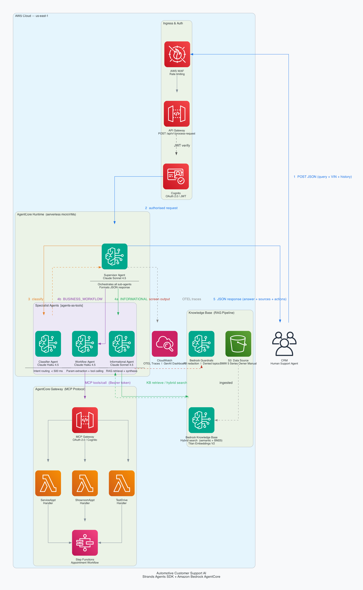

# Agentic Customer Support

An AI-powered customer support system built on **Amazon Bedrock AgentCore** and the **Strands Agents SDK**. Human support agents click "Generate" in their CRM — the system responds with a suggested reply, knowledge base citations, and workflow action status. The AI never communicates directly with end customers.



---

## How it works

A single API call from the CRM triggers a multi-agent pipeline:

```
CRM / Streamlit demo
    ↓
AgentCore Runtime  (serverless ARM64 container)
    ↓
SUPERVISOR (Claude Sonnet 4.5)
    ├── CLASSIFIER (Claude Haiku 4.5)   — intent: INFORMATIONAL or BUSINESS_WORKFLOW
    ├── INFORMATIONAL (Claude Sonnet 4.5) — RAG via Bedrock Knowledge Base + Pinecone
    └── WORKFLOW (Claude Haiku 4.5)     — action execution via AgentCore Gateway (MCP)
    ↓
Structured JSON → human agent reviews → sends to customer
```

The Supervisor uses the **agents-as-tools** pattern: each sub-agent is a plain `@tool` function, keeping orchestration explicit and token costs auditable.

---

## Key design decisions

| Decision | Rationale |
|---|---|
| Agents-as-tools over full orchestration | Simpler debugging, clear per-agent token accounting |
| Haiku for Classifier and Workflow | Classification needs no RAG; Workflow is parameter extraction + one tool call — Haiku is sufficient and cheaper |
| Human-in-the-loop only | AI generates suggestions; humans review and send — no autonomous customer contact |
| Custom `retrieve_kb` tool | `strands_tools.memory` does not extract S3 URIs from KB results; custom tool maps `s3Location.uri` directly |
| Guardrails on tool outputs | `GuardrailHook` screens sub-agent results before they reach the Supervisor model (`AfterToolCallEvent`), not after |
| Fail-open guardrail | If the Guardrail API fails the hook returns `None` and the pipeline continues — avoids cascading failures |
| Thread-safe token cache | Cognito OAuth2 tokens are cached with a 5-minute expiry buffer, avoiding a round-trip on every workflow request |
| Pure vector search (Pinecone) | Pinecone cosine indexes do not support BM25/hybrid; `overrideSearchType: HYBRID` is only valid for OpenSearch Serverless and Aurora |

---

## Tech stack

| Layer | Technology |
|---|---|
| Agent SDK | [Strands Agents](https://github.com/strands-agents/sdk-python) (`strands-agents[otel]`) |
| Agent runtime | Amazon Bedrock AgentCore Runtime (serverless, ARM64) |
| Supervisor / Informational LLM | `us.anthropic.claude-sonnet-4-5-20250929-v1:0` |
| Classifier / Workflow LLM | `us.anthropic.claude-haiku-4-5-20251001-v1:0` |
| RAG | Bedrock Knowledge Bases + Pinecone serverless (cosine, 1024-dim) |
| Embeddings | Amazon Titan Text Embeddings V2 |
| Tool connectivity | AgentCore Gateway — MCP Streamable HTTP |
| Workflow execution | AWS Lambda + Step Functions (via Gateway) |
| Auth (Gateway) | Cognito OAuth2 client credentials |
| Content safety | Bedrock Guardrails — PII redaction + competitor topic denial |
| Observability | Strands native OTEL → X-Ray + CloudWatch |
| Container build | AWS CodeBuild (ARM), ECR |
| IaC | Terraform ≥ 1.6, AWS provider ~> 6.21, pinecone-io/pinecone ~> 2.0 |

---

## Repository structure

```
.
├── agents/
│   ├── supervisor_agent.py      # AgentCore entrypoint; orchestrates sub-agents
│   ├── classifier_agent.py      # Haiku intent classifier (no tools)
│   ├── informational_agent.py   # Sonnet RAG agent with custom retrieve_kb tool
│   ├── workflow_agent.py        # Haiku workflow agent; connects to Gateway via MCP
│   ├── models.py                # Pydantic schemas: CRMRequest, SupervisorResponse
│   ├── hooks/
│   │   └── guardrail_hook.py    # Strands HookProvider — screens tool outputs
│   ├── Dockerfile               # ARM64, Python 3.11-slim, non-root user
│   └── requirements.txt
├── terraform/
│   ├── providers.tf             # AWS + Pinecone + archive + null providers
│   ├── variables.tf             # Input variables with validation
│   ├── kb.tf                    # Bedrock Knowledge Base + S3 data source
│   ├── pinecone.tf              # Pinecone serverless index + Secrets Manager
│   ├── agentcore.tf             # ECR, CodeBuild pipeline, AgentCore Runtime, IAM
│   └── outputs.tf               # Runtime ARN, KB ID, ECR URL
├── data/
│   └── 2022-bmw-5-series.pdf    # PoV knowledge base document
├── generated-diagrams/          # Architecture diagrams
├── streamlit_demo.py            # Local demo UI (Cloud or Local invocation mode)
└── solution-design.md           # Original architecture document
```

---

## API contract

**Request** (CRM → Supervisor):

```json
{
  "customer_query": "What does the orange triangle warning light mean?",
  "customer_id": "CUST-00123",
  "ticket_id": "TKT-4567",
  "conversation_history": [
    {"role": "customer", "content": "..."},
    {"role": "agent",    "content": "..."}
  ],
  "metadata": {
    "vehicle_vin": "WBA12345678901234",
    "model": "BMW 5 Series",
    "year": "2022",
    "dealership_id": "BMW-LONDON-001"
  }
}
```

**Response** (Supervisor → CRM):

```json
{
  "request_type": "INFORMATIONAL",
  "classification": "dashboard_warning_query",
  "response": "The orange triangle with an exclamation mark indicates...",
  "sources": [
    {
      "uri": "s3://my-bucket/2022-bmw-5-series.pdf",
      "text": "The general warning lamp (orange triangle)...",
      "score": 0.87
    }
  ],
  "confidence": 0.92,
  "escalation_needed": false,
  "workflow_actions": []
}
```

`escalation_needed` is set to `true` when confidence < 0.7, the query involves a safety-critical issue (red warning light, brake failure, airbag), or the workflow agent returns `MISSING_PARAMS` or `FAILED`.

---

## Prerequisites

- AWS account with Bedrock model access (Claude Sonnet 4.5, Haiku 4.5, Titan Embeddings V2)
- [Pinecone](https://app.pinecone.io) account — free Starter tier is sufficient
- Terraform ≥ 1.6
- Docker (for local container testing)
- Python ≥ 3.11

---

## Deployment

### 1. Bootstrap infrastructure

```bash
cd terraform

# Create terraform.tfvars (not committed — contains your Pinecone API key)
cat > terraform.tfvars <<EOF
pinecone_api_key = "pcsk_..."
EOF

terraform init
terraform apply
```

Terraform provisions:
- S3 bucket (PDF upload) + Bedrock Knowledge Base (Pinecone-backed)
- Bedrock Guardrail (PII redaction + competitor topic policy)
- ECR repository + CodeBuild pipeline (ARM64 build + push)
- AgentCore Runtime with IAM execution role

### 2. Build and push the agent container

The CodeBuild project triggers automatically on `terraform apply`. To rebuild after code changes:

```bash
terraform apply -replace=null_resource.trigger_supervisor_build
```

### 3. Sync the knowledge base

After the PDF is uploaded to S3 by Terraform:

```bash
aws bedrock-agent start-ingestion-job \
  --knowledge-base-id <KNOWLEDGE_BASE_ID> \
  --data-source-id <DATA_SOURCE_ID> \
  --region us-east-1
```

`KNOWLEDGE_BASE_ID` and `DATA_SOURCE_ID` are available in `terraform output`.

---

## Local testing

```bash
# Install the AgentCore CLI (requires Python 3.11+)
pip install bedrock-agentcore-starter-toolkit

# Configure the entrypoint
agentcore configure --entrypoint agents/supervisor_agent.py --non-interactive

# Start local server (Docker required)
agentcore launch --local

# Test informational query
agentcore invoke '{
  "customer_query": "How does adaptive cruise control work?",
  "metadata": {"model": "BMW 5 Series", "year": "2022"}
}'

# Test workflow query
agentcore invoke '{
  "customer_query": "I want to book a service appointment for an oil change",
  "metadata": {"vehicle_vin": "WBA12345678901234", "dealership_id": "BMW-LONDON-001"}
}'
```

### Streamlit demo

```bash
pip install streamlit boto3 httpx
streamlit run streamlit_demo.py
```

Select **Local** mode to point at `localhost:8080`, or **Cloud** mode and paste your AgentCore Runtime ARN from `terraform output`.

---

## Environment variables

All injected at runtime by the AgentCore Runtime (set by Terraform):

| Variable | Purpose |
|---|---|
| `KNOWLEDGE_BASE_ID` | Bedrock KB ID — read by `retrieve_kb` |
| `BEDROCK_GUARDRAIL_ID` | Guardrail resource ID |
| `BEDROCK_GUARDRAIL_VER` | Guardrail version |
| `AWS_REGION` | `us-east-1` |
| `LOG_LEVEL` | `INFO` (also accepts `DEBUG`, `WARNING`, `ERROR`) |
| `OTEL_EXPORTER_OTLP_ENDPOINT` | `https://xray.us-east-1.amazonaws.com` |
| `GATEWAY_MCP_URL` | AgentCore Gateway MCP endpoint |
| `GATEWAY_TOKEN_ENDPOINT` | Cognito token URL |
| `GATEWAY_CLIENT_ID` | Cognito app client ID |
| `GATEWAY_CLIENT_SECRET` | Cognito app client secret |

---

## Observability

Strands Agents emits OpenTelemetry traces automatically. The container entrypoint wraps the process with `opentelemetry-instrument`:

```dockerfile
CMD ["opentelemetry-instrument", "python", "-m", "supervisor_agent"]
```

Traces flow to X-Ray via the OTLP exporter. Each agent invocation is tagged with `gen_ai.agent.name`, `session.id`, and `customer.id` for filtering in the X-Ray console and CloudWatch GenAI Observability dashboard.

---

## Knowledge base (PoV phase)

A single Bedrock Knowledge Base (`customer-support-public-docs`) backed by Pinecone serverless:

- **Data**: `data/2022-bmw-5-series.pdf` — uploaded to S3 by Terraform, ingested via Bedrock data source
- **Chunking**: hierarchical — parent 600 tokens / child 150 tokens, 40-token overlap
- **Parsing**: `BEDROCK_FOUNDATION_MODEL` for accurate PDF table and layout extraction
- **Search**: dense vector (cosine) — pure semantic search

To extend to additional documents, upload PDFs to the S3 data source bucket and re-run the ingestion job.

---

## IAM — AgentCore execution role

The execution role (`<prefix>-agentcore-exec-role`) has inline permissions for:

- Bedrock model invocation — Sonnet and Haiku cross-region inference profiles
- Bedrock KB `Retrieve`
- Bedrock Guardrail `ApplyGuardrail`
- AgentCore workload access tokens
- ECR image pull
- CloudWatch Logs write + X-Ray `PutTraceSegments`

Managed policies attached: `BedrockAgentCoreFullAccess`, `AWSMarketplaceManageSubscriptions`.
