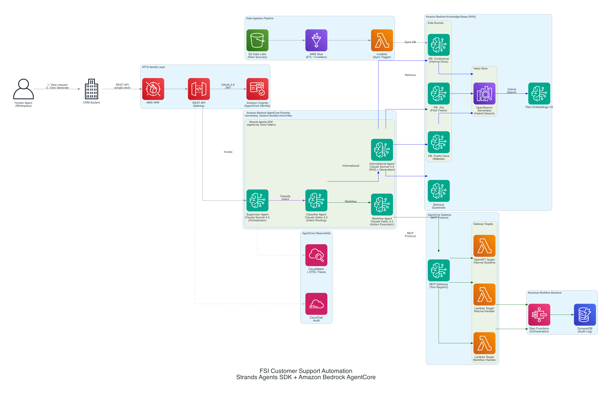

# Enterprise Customer Support AI Solution
## Strands Agents SDK + Amazon Bedrock AgentCore Architecture

---

## Executive Summary

This document outlines an AI-powered customer support automation solution designed to reduce human agent workload by 60-80% while maintaining high-quality, contextual responses. The solution leverages the **AWS GenAI Stack** built on **Strands Agents SDK** (open-source Agent Development Kit) deployed to **Amazon Bedrock AgentCore Runtime** — a serverless, session-isolated runtime purpose-built for AI agents. It uses **Amazon Bedrock Knowledge Bases** with **Amazon OpenSearch Serverless** for hybrid search RAG, and **AgentCore Gateway** (MCP Protocol) for secure tool connectivity to business workflow backends.

**Key Technology Stack:**

| Component | Technology |
|-----------|-----------|
| **Agent Development Kit (ADK)** | Strands Agents SDK (open-source, Python) |
| **Agent Runtime** | Amazon Bedrock AgentCore Runtime (serverless, microVM session isolation) |
| **Orchestration LLM** | Claude Sonnet 4.5 on Amazon Bedrock (complex reasoning, generation) |
| **Classification LLM** | Claude Haiku 4.5 on Amazon Bedrock (fast intent routing, low latency) |
| **RAG** | Amazon Bedrock Knowledge Bases + OpenSearch Serverless (hybrid search) |
| **Tool Connectivity** | AgentCore Gateway (MCP Protocol) |
| **Observability** | AgentCore Observability (OTEL traces → CloudWatch) |
| **Identity** | AgentCore Identity (Cognito, OAuth 2.0) |

**Key Benefits:**
- Non-interactive, single-shot "Generate" integration — human agent reviews proposed responses before sending
- Multi-agent architecture with specialized agents for classification, RAG, and workflow execution
- Hybrid search combining semantic (vector) and lexical (BM25) approaches
- Structured JSON output for CRM integration
- Session-isolated microVMs for security requirements
- Stateless design — no memory needed; CRM provides full context per request
- Scalable, serverless architecture — pay only for actual usage

---

## Table of Contents

1. [Solution Overview](#solution-overview)
2. [Architecture Design](#architecture-design)
3. [Component Details](#component-details)
4. [Multi-Agent Design with Strands Agents SDK](#multi-agent-design-with-strands-agents-sdk)
5. [Chunking Strategy](#chunking-strategy)
6. [RAG Testing & Metrics](#rag-testing--metrics)
7. [Implementation Roadmap](#implementation-roadmap)
8. [Cost Considerations](#cost-considerations)
9. [Security & Compliance](#security--compliance)

---

## Solution Overview

### Business Requirements

**Primary Goal:** Reduce time human support agents spend processing customer requests.

**Request Categories:**

#### 1. Informational Requests
Retrieve responses from internal knowledge bases:
- **Internal KB**: Confluence pages
- **Past Support Cases**: Jira tickets
- **Public Documentation**: Product manuals, help articles

**Requirements:**
- Semantic extraction of insights from existing data
- Lexical search for exact matches (product codes, error messages)
- Structured JSON output format

#### 2. Business Workflow Requests
Trigger internal business processes:
- Initiate refund requests
- Modify orders
- Create escalation tickets
- Update customer records
- Trigger approval workflows

### Technical Requirements

- **REST API exposure** for CRM system integration
- **AWS GenAI Stack** based solution
- **Amazon Bedrock** for foundation models (Claude Sonnet 4.5, Haiku 4.5)
- **Strands Agents SDK** as Agent Development Kit (ADK)
- **Amazon Bedrock AgentCore** for agent runtime, memory, gateway, and observability
- **Knowledge Bases** for RAG implementation
- **OpenSearch Serverless** as vector store with hybrid search

---

## Architecture Design

### Architecture Diagram



### High-Level Architecture

```
┌─────────────────────────────────────────────────────────────────────────────┐
│                       CUSTOMER SUPPORT AI AUTOMATION                         │
│           Strands Agents SDK + Amazon Bedrock AgentCore                      │
└─────────────────────────────────────────────────────────────────────────────┘

┌──────────────┐
│  CRM System  │──────┐
└──────────────┘      │
                      │
┌──────────────┐      │        ┌──────────────────────────────────────────┐
│   Customers  │──────┼───────>│  API Gateway + AWS WAF                   │
└──────────────┘      │        │  + AgentCore Identity (Cognito OAuth2)   │
                      │        └─────────────┬────────────────────────────┘
┌──────────────┐      │                      │
│  Support UI  │──────┘                      v
└──────────────┘          ┌──────────────────────────────────────────────┐
                          │  BEDROCK AGENTCORE RUNTIME                    │
                          │  (Serverless, Session-Isolated microVMs)      │
                          │                                                │
                          │  ┌────────────────────────────────────────┐   │
                          │  │  STRANDS AGENTS SDK (Multi-Agent)      │   │
                          │  │                                        │   │
                          │  │  ┌─────────────────────┐              │   │
                          │  │  │  Supervisor Agent    │              │   │
                          │  │  │  (Claude Sonnet 4.5) │              │   │
                          │  │  └─────────┬───────────┘              │   │
                          │  │            │                            │   │
                          │  │            v                            │   │
                          │  │  ┌─────────────────┐                  │   │
                          │  │  │ Classifier Agent │                  │   │
                          │  │  │ (Haiku 4.5)      │                  │   │
                          │  │  └───┬─────────┬───┘                  │   │
                          │  │      │         │                       │   │
                          │  │      v         v                      │   │
                          │  │ ┌─────────┐ ┌──────────┐             │   │
                          │  │ │Info     │ │Workflow  │             │   │
                          │  │ │Agent    │ │Agent     │             │   │
                          │  │ │(Sonnet  │ │(Haiku    │             │   │
                          │  │ │ 4.5)    │ │ 4.5)     │             │   │
                          │  │ └────┬────┘ └────┬─────┘             │   │
                          │  └──────┼───────────┼───────────────────┘   │
                          └─────────┼───────────┼───────────────────────┘
                                    │           │
                    ┌───────────────┘           └────────────────┐
                    │                                             │
                    v                                             v
┌────────────────────────────────────┐  ┌──────────────────────────────────┐
│  BEDROCK KNOWLEDGE BASES (RAG)     │  │  AGENTCORE GATEWAY (MCP)         │
│  + OpenSearch Serverless           │  │                                   │
│  + Hybrid Search (Semantic+Lexical)│  │  Gateway Targets:                │
│  + Bedrock Guardrails              │  │  - Lambda: Refund Handler         │
│                                     │  │  - Lambda: Workflow Handler       │
│  Data Sources:                      │  │  - OpenAPI: Internal Systems      │
│  - Confluence (native connector)    │  └──────────┬──────────────────────┘
│  - Jira (S3 via ETL)               │              │
│  - Public Docs (web crawler)        │              v
└─────────────────────────────────────┘  ┌──────────────────────────────────┐
                                          │  Step Functions + DynamoDB       │
                                          │  (Workflow Orchestration + Audit)│
                                          └──────────────────────────────────┘
```

---

## Component Details

### 1. API & Identity Layer

#### Amazon API Gateway
- **Type**: REST API
- **Authentication**: AgentCore Identity integration with Amazon Cognito
  - OAuth 2.0 client credentials grant for CRM machine-to-machine auth
  - JWT token validation at API Gateway
- **Protection**: AWS WAF (rate limiting, IP filtering, SQL injection / XSS prevention)
- **Features**: Request/response validation, throttling, API versioning, CloudWatch logging

**API Contract:**

```json
POST /api/v1/process-request
Authorization: Bearer <JWT>
Content-Type: application/json

{
  "session_id": "uuid",
  "customer_id": "C-12345",
  "request_text": "I need a refund for transaction TXN-98765",
  "context": {
    "channel": "chat",
    "priority": "high"
  }
}
```

**Response:**

```json
{
  "session_id": "uuid",
  "request_type": "BUSINESS_WORKFLOW",
  "classification": "refund_request",
  "response": {
    "status": "initiated",
    "workflow_id": "WF-2026-00123",
    "message": "Refund request for TXN-98765 has been initiated.",
    "next_steps": ["Refund approval pending", "Customer notification scheduled"]
  },
  "sources": [],
  "confidence": 0.95
}
```

### 2. Amazon Bedrock AgentCore Runtime

AgentCore Runtime is a **serverless, session-isolated runtime** purpose-built for AI agents. Each user session runs in a **dedicated microVM**, providing complete isolation — critical for compliance.

| Capability | Details |
|-----------|---------|
| **Session Isolation** | Dedicated microVMs per user session |
| **Scaling** | Scales to thousands of sessions in seconds |
| **Deployment** | `agentcore configure` + `agentcore deploy` (zero infrastructure management) |
| **Auth Integration** | AgentCore Identity: Cognito, Entra ID, Okta, Google, GitHub |
| **Streaming** | SSE for real-time response streaming to CRM |
| **VPC Connectivity** | VPC endpoints for accessing private resources (databases, internal APIs) |
| **Pricing** | Pay per actual usage (no idle costs) |

**Deployment:**
```bash
# Configure the Strands agent for AgentCore Runtime
agentcore configure --entrypoint supervisor_agent.py

# Deploy to production (serverless, auto-scaling)
agentcore deploy

# Test invocation
agentcore invoke '{"prompt": "I need a refund for TXN-98765"}'
```

### 3. Interaction Model: Stateless Single-Shot (No Memory Needed)

This solution operates in a **non-interactive, human-in-the-loop** pattern:

```
Customer submits request → CRM captures it → Human agent opens workspace
  → Agent clicks "Generate" → AI proposes response (single API call)
    → Human agent reviews/edits → Sends to customer
```

**Why no AgentCore Memory (STM or LTM) is required:**

| Memory Type | Why Not Needed |
|------------|----------------|
| **Short-Term Memory** | No multi-turn conversation. Each "Generate" click is a single, independent API call. There are no prior turns to recall. |
| **Long-Term Memory** | The CRM already holds the customer's complete history (account tier, past tickets, preferences). This context is passed in the API request payload — no need to duplicate it in agent-side memory. |

**All context is provided in the request payload by the CRM:**

```json
{
  "customer_id": "C-12345",
  "request_text": "I need a refund for transaction TXN-98765",
  "context": {
    "customer_tier": "premium",
    "account_since": "2020-03-15",
    "communication_preference": "email",
    "recent_tickets": ["JIRA-1234", "JIRA-5678"],
    "order_history": [{"id": "ORD-98765", "amount": 150.00, "date": "2026-01-20"}]
  }
}
```

The **Knowledge Bases** handle historical/institutional knowledge (past similar cases from Jira, policies from Confluence). The **CRM payload** provides customer-specific context. Together, these eliminate any need for agent-side memory.

### 4. AgentCore Gateway (MCP Protocol)

AgentCore Gateway provides a **managed MCP (Model Context Protocol) endpoint** for tool connectivity. The Workflow Agent accesses business backend tools through the gateway.

| Feature | Details |
|---------|---------|
| **Protocol** | Model Context Protocol (MCP) — standard for agent-tool communication |
| **Authentication** | OAuth 2.0 via Cognito (auto-provisioned), or custom JWT |
| **Semantic Search** | Enabled — agent can discover tools by description |
| **Target Types** | Lambda functions, OpenAPI schemas, Smithy models, MCP servers |
| **Scaling** | Fully managed, auto-scaling |

**Gateway Targets for this solution:**

| Target Name | Type | Purpose |
|-------------|------|---------|
| `RefundHandler` | Lambda | Process refund requests, validate eligibility, initiate refund workflow |
| `WorkflowHandler` | Lambda | Route to Step Functions for escalation, callback scheduling, ticket creation |
| `InternalSystemsAPI` | OpenAPI | Connect to internal CRM/ERP APIs for account updates, order modifications |

### 5. Amazon Bedrock Knowledge Bases (RAG)

#### Data Sources & Knowledge Bases

| Knowledge Base | Data Source | Connector | Sync Frequency |
|---------------|------------|-----------|----------------|
| **KB-Confluence** | Internal documentation, policies, procedures | Amazon Bedrock Confluence connector (native) | Every 6 hours (incremental) |
| **KB-Jira** | Past support cases, resolutions, known issues | S3 via ETL pipeline (AWS Glue extracts from Jira API → structured markdown → S3) | Every 4 hours |
| **KB-PublicDocs** | Customer-facing documentation from website | Amazon Bedrock Web Crawler connector | Daily |

#### Vector Store — Amazon OpenSearch Serverless

| Configuration | Value |
|--------------|-------|
| **Collection Type** | Vector search |
| **Encryption** | AWS KMS (CMK) at rest; TLS 1.2+ in transit |
| **Access Policy** | IAM-based; Bedrock service role only |
| **Index Configuration** | HNSW algorithm, 1024 dimensions (Titan Embeddings V2) |
| **Hybrid Search** | Enabled — combines vector (semantic) and text (lexical/BM25) search |
| **Scaling** | Serverless — auto-scales with query volume (min 2 OCUs) |

#### Hybrid Search Strategy

Amazon Bedrock Knowledge Bases with OpenSearch Serverless supports **hybrid search**:

- **Semantic search** (vector embeddings): Understands meaning and intent. E.g., "how do I get my money back" matches refund policy documents even without the word "refund"
- **Lexical search** (BM25 keyword matching): Exact term matching for specific identifiers, policy numbers, error codes. E.g., "Policy 2024-REFUND-003" matches the exact document

The hybrid approach is critical because:
- Regulatory documents require exact keyword matching (policy IDs, regulatory codes)
- Customer queries are often natural language requiring semantic understanding
- Combined scoring produces higher-relevance results than either method alone

#### Embedding & Generation

| Component | Configuration |
|-----------|--------------|
| **Embedding Model** | Amazon Titan Text Embeddings V2 (1024 dimensions, hierarchical chunking) |
| **Reranking** | Enabled — Bedrock reranking model reorders retrieved chunks by relevance |
| **Generation Model** | Claude Sonnet 4.5 (via Informational Agent) |
| **Guardrails** | Bedrock Guardrails: PII redaction, denied topics (investment advice, account credentials), content filtering |
| **Citations** | Included — source document URI, chunk text, and relevance score |

### 6. Business Workflow Backend

| Component | Role |
|-----------|------|
| **AWS Lambda** | Gateway target handlers — validate parameters, initiate workflows |
| **AWS Step Functions** | Orchestrate multi-step business processes (approval → payment → notification) |
| **Amazon DynamoDB** | Audit log (all agent interactions), workflow tracking, session state backup |

### 7. AgentCore Observability

| Feature | Implementation |
|---------|---------------|
| **Distributed Tracing** | OTEL traces from Strands Agents → CloudWatch via AWS ADOT |
| **Metrics** | Agent invocations, latency (p50/p95/p99), token usage, error rates |
| **Dashboard** | GenAI Observability: Bedrock AgentCore Observability dashboard in CloudWatch |
| **Audit Trail** | CloudTrail for API calls; DynamoDB for all agent interaction logs |

---

## Multi-Agent Design with Strands Agents SDK

### Why Strands Agents SDK?

Strands Agents is an **open-source Agent Development Kit (ADK)** that provides:
- **Model-agnostic**: Works with any LLM provider (Bedrock, OpenAI, etc.)
- **Multi-agent patterns**: Graph, Swarm, Workflow, and Agents-as-Tools
- **Native AgentCore integration**: First-class deployment to AgentCore Runtime
- **Tool ecosystem**: Python tools, MCP tools, community tools
- **Hooks system**: Lifecycle hooks for memory, logging, guardrails
- **Session management**: Built-in conversation state handling

### Multi-Agent Architecture: Agents-as-Tools Pattern

This solution uses the **Agents-as-Tools** pattern where specialized agents are wrapped as tools and provided to a Supervisor Agent. The Supervisor routes tasks to the appropriate specialist based on intent classification.

```
┌─────────────────────────────────────────────────────────────────┐
│                    STRANDS MULTI-AGENT SYSTEM                    │
│                                                                  │
│  ┌──────────────────────────────────────────────────────────┐   │
│  │              SUPERVISOR AGENT                             │   │
│  │              Model: Claude Sonnet 4.5                     │   │
│  │              Role: Central orchestrator                   │   │
│  │              Tools: [classifier, info_agent, wf_agent]    │   │
│  │              Hooks: [GuardrailHook, AuditHook]           │   │
│  └────────────────────┬─────────────────────────────────────┘   │
│                       │                                          │
│           ┌───────────┼───────────┐                              │
│           │           │           │                              │
│           v           v           v                              │
│  ┌──────────────┐ ┌──────────┐ ┌──────────────┐                │
│  │ Classifier   │ │  Info    │ │  Workflow     │                │
│  │ Agent        │ │  Agent   │ │  Agent        │                │
│  │              │ │          │ │               │                │
│  │ Model:       │ │ Model:   │ │ Model:        │                │
│  │ Haiku 4.5    │ │ Sonnet   │ │ Haiku 4.5     │                │
│  │              │ │ 4.5      │ │               │                │
│  │ Role: Fast   │ │ Role:    │ │ Role: Execute │                │
│  │ intent       │ │ RAG      │ │ business      │                │
│  │ classifi-    │ │ retrieval│ │ workflows     │                │
│  │ cation       │ │ + gen    │ │ via MCP       │                │
│  │              │ │          │ │ Gateway       │                │
│  │ Tools: []    │ │ Tools:   │ │ Tools:        │                │
│  │              │ │ [memory, │ │ [MCP gateway  │                │
│  │              │ │  KB      │ │  tools]       │                │
│  │              │ │  retrieve]│ │              │                │
│  └──────────────┘ └──────────┘ └──────────────┘                │
└─────────────────────────────────────────────────────────────────┘
```

### Agent Specifications

#### Supervisor Agent (Orchestrator)

| Attribute | Configuration |
|-----------|--------------|
| **Model** | Claude Sonnet 4.5 (`us.anthropic.claude-sonnet-4-5-20250929-v1:0`) |
| **Role** | Central orchestrator; manages conversation flow, delegates to specialists |
| **Tools** | `classifier_agent`, `info_agent`, `workflow_agent` (agents wrapped as tools) |
| **Hooks** | `GuardrailHook` (content filtering), `AuditHook` (log to DynamoDB) |
| **State** | Stateless — all context provided in request payload by CRM |

**System Prompt:**
```
You are a customer support supervisor agent. For every request:
1. Use the classifier agent to determine intent (INFORMATIONAL or BUSINESS_WORKFLOW)
2. Route INFORMATIONAL requests to the info agent for knowledge base retrieval
3. Route BUSINESS_WORKFLOW requests to the workflow agent for action execution
4. Format all responses as structured JSON with: request_type, classification,
   response, sources, confidence
5. NEVER provide investment advice or share account credentials
6. If confidence < 0.7, include escalation_needed: true in the response
7. Maintain professional tone appropriate for customer support
```

#### Classifier Agent (Intent Router)

| Attribute | Configuration |
|-----------|--------------|
| **Model** | Claude Haiku 4.5 (`us.anthropic.claude-haiku-4-5-20251001-v1:0`) |
| **Role** | Fast intent classification; routes to appropriate specialist |
| **Tools** | None (pure classification, no tool use needed) |
| **Latency Target** | < 500ms |

**Why Haiku 4.5 for classification:**
- 10x cheaper than Sonnet 4.5
- Sub-500ms latency for instant routing
- Classification is a straightforward task that doesn't require complex reasoning
- Reduces overall cost per request significantly

**System Prompt:**
```
You are an intent classifier for customer support. Classify the query into exactly one:
- INFORMATIONAL: Questions about policies, procedures, product info, past cases
- BUSINESS_WORKFLOW: Requests to take action (refunds, modifications, escalations)
Respond with ONLY the classification and a brief reason.
```

#### Informational Agent (RAG Specialist)

| Attribute | Configuration |
|-----------|--------------|
| **Model** | Claude Sonnet 4.5 |
| **Role** | Query Knowledge Bases, synthesize responses with citations |
| **Tools** | `memory` (Bedrock KB retrieve tool), `use_llm` (for response synthesis) |
| **Search Type** | Hybrid (semantic + lexical) |
| **Reranking** | Enabled |

**Why Sonnet 4.5 for informational:**
- Complex reasoning needed to synthesize information from multiple KB sources
- High-quality response generation with accurate citations
- Better at following structured JSON output format
- Handles multi-hop reasoning (combining info from Confluence + Jira)

#### Workflow Agent (Action Executor)

| Attribute | Configuration |
|-----------|--------------|
| **Model** | Claude Haiku 4.5 |
| **Role** | Extract parameters from conversation, invoke business tools via MCP Gateway |
| **Tools** | MCP Gateway tools (RefundHandler, WorkflowHandler, InternalSystemsAPI) |

**Why Haiku 4.5 for workflow:**
- Parameter extraction is straightforward
- Tool invocation doesn't require complex reasoning
- Lower cost for high-volume action requests
- Low latency for responsive workflow initiation

### Model Selection Strategy: Claude Sonnet 4.5 vs Haiku 4.5

| Dimension | Sonnet 4.5 | Haiku 4.5 |
|-----------|-----------|-----------|
| **Use in this solution** | Supervisor, Informational Agent | Classifier, Workflow Agent |
| **Strength** | Complex reasoning, synthesis, structured output | Speed, classification, parameter extraction |
| **Latency** | ~2-3s | ~300-500ms |
| **Cost (input)** | $3 / 1M tokens | $0.80 / 1M tokens |
| **Cost (output)** | $15 / 1M tokens | $4 / 1M tokens |
| **When to use** | Multi-source synthesis, nuanced responses, complex JSON | Binary classification, entity extraction, tool calling |

---

## Chunking Strategy

### Recommendation: Hierarchical Chunking Across All Three KBs

After evaluating all available Bedrock chunking strategies (fixed-size, hierarchical, semantic, none), **hierarchical chunking** is the optimal choice for all three Knowledge Bases in this solution, with **per-source parameter tuning** and **Glue preprocessing for Jira data**.

### Why Hierarchical Over Semantic?

Both hierarchical and semantic are superior to fixed-size, but they solve fundamentally different problems:

| | Hierarchical | Semantic |
|---|---|---|
| **Splitting logic** | Fixed token boundaries at 2 levels (parent + child) | FM analyzes sentence similarity, splits at meaning boundaries |
| **Retrieval mechanism** | Searches child chunks → **replaces with parent** before sending to LLM | Returns the semantic chunks directly — no automatic context expansion |
| **Ingestion cost** | Standard (no FM calls) | **Higher** — uses FM to compute sentence embeddings at ingestion |
| **Determinism** | Fully deterministic — same config always produces same chunks | Semi-deterministic — depends on FM's similarity scoring |
| **Best for** | Structured/semi-structured documents with headings and sections | Unstructured prose with no clear structure (essays, transcripts) |

**Hierarchical wins for this use case because:**

1. **Human agent needs a complete, cite-able answer in one shot.** Child chunks precisely match the query; parent chunks give the LLM enough surrounding context to generate a comprehensive response — not a fragment.

2. **Hybrid search works better with smaller child chunks.** In OpenSearch Serverless, hybrid search combines vector search on child embeddings (precise semantic match) + BM25 keyword search on child text (exact terms like "REFUND-003"). Smaller child chunks produce **more focused embeddings** — a 200-token child about "premium tier refund eligibility" creates a sharper vector than a 400-token semantic chunk that also discusses general refund timelines.

3. **All three data sources have explicit or enforceable structure.** Confluence and public docs have headings/sections natively. Jira data can be preprocessed into structured markdown via AWS Glue. Semantic chunking's strength — finding meaning boundaries in unstructured text — is unnecessary when structure already exists.

4. **Semantic chunking can merge or split incorrectly.** Two subsections about "eligibility" and "exceptions" might be merged by semantic chunking (they're topically similar), losing the distinction. Or a long process section might be split mid-step if sentences are sufficiently different. Hierarchical chunking respects explicit boundaries.

> **When to reconsider semantic:** If you later add an unstructured data source (e.g., raw email threads, call transcripts, chat logs) where no document structure exists, use semantic chunking for that specific KB.

### Per-Source Configuration

#### KB-Confluence (Internal Policies & Procedures) → Hierarchical

Confluence pages are **long, structured documents** with natural hierarchy (page → section → subsection → paragraph). Policies often have cross-references within sections ("subject to clause 3.2 above") that parent chunks capture.

```json
{
  "chunkingStrategy": "HIERARCHICAL",
  "hierarchicalChunkingConfiguration": {
    "levelConfigurations": [
      { "maxTokens": 800 },
      { "maxTokens": 200 }
    ],
    "overlapTokens": 60
  }
}
```

| Parameter | Value | Rationale |
|-----------|-------|-----------|
| **Parent** | 800 tokens (~600 words) | Captures a full policy section with conditions, exceptions, and cross-references |
| **Child** | 200 tokens (~150 words) | Matches individual subsections/paragraphs for precise retrieval |
| **Overlap** | 60 tokens | Higher overlap because policy language often references preceding clauses |

**Example mapping:**
```
## 3. Refund Policy                          ← Parent chunk boundary
### 3.1 Eligibility                          ← Child chunk 1
Customers are eligible for refunds within
30 days of purchase...

### 3.2 Exceptions                           ← Child chunk 2
Premium tier customers may request refunds
up to 90 days...

### 3.3 Process                              ← Child chunk 3
To initiate a refund, the agent must...
```

#### KB-Jira (Past Support Cases) → Hierarchical with Glue Preprocessing

Jira tickets are semi-structured and variable-length. Raw ticket data (HTML, varied formats) would normally favor semantic chunking. However, by **preprocessing via AWS Glue into structured markdown**, hierarchical chunking works well and produces more predictable results.

**Step 1: Glue ETL preprocesses Jira into structured markdown:**

```markdown
## Ticket: JIRA-1234
**Summary:** Customer unable to process refund for order ORD-5678
**Status:** Resolved | **Priority:** High | **Category:** Refund
**Created:** 2026-01-15 | **Resolved:** 2026-01-16

### Problem Description
Customer reported that refund for order ORD-5678 failed with
error AUTH_TOKEN_EXPIRED during payment gateway processing...

### Resolution Steps
1. Verified order status in ERP — confirmed eligible for refund
2. Reset payment gateway authentication token
3. Reprocessed refund — completed successfully

### Agent Notes
Root cause: Payment gateway token rotation policy changed on
2026-01-10. Tokens now expire after 24 hours instead of 7 days.
```

**Step 2: Hierarchical chunking on structured output:**

```json
{
  "chunkingStrategy": "HIERARCHICAL",
  "hierarchicalChunkingConfiguration": {
    "levelConfigurations": [
      { "maxTokens": 1000 },
      { "maxTokens": 250 }
    ],
    "overlapTokens": 50
  }
}
```

| Parameter | Value | Rationale |
|-----------|-------|-----------|
| **Parent** | 1000 tokens | Larger parent to capture the **full ticket** (problem + resolution + notes) as a single context unit |
| **Child** | 250 tokens | Matches individual sections (problem description, resolution steps) for precise retrieval |
| **Overlap** | 50 tokens | Standard overlap; structured sections have clean boundaries |

**Why larger parent for Jira:** The most valuable retrieval pattern is *"find a past case similar to this problem AND its resolution."* A 1000-token parent ensures the LLM sees both problem and resolution together, even if only the problem-description child chunk matched the query.

#### KB-PublicDocs (Website Documentation) → Hierarchical

Public documentation is structured with clear headings but typically **shorter and more concise** than internal Confluence pages.

```json
{
  "chunkingStrategy": "HIERARCHICAL",
  "hierarchicalChunkingConfiguration": {
    "levelConfigurations": [
      { "maxTokens": 600 },
      { "maxTokens": 150 }
    ],
    "overlapTokens": 40
  }
}
```

| Parameter | Value | Rationale |
|-----------|-------|-----------|
| **Parent** | 600 tokens | Smaller parent — public docs pages are shorter and more focused than internal policies |
| **Child** | 150 tokens | Smaller child — public doc paragraphs tend to be concise, standalone answers |
| **Overlap** | 40 tokens | Lower overlap — clean heading-based boundaries have less cross-reference |

### Hybrid Search Configuration (All KBs)

Hybrid search is applied at retrieval time and works the same across all three KBs:

```json
{
  "retrievalConfiguration": {
    "vectorSearchConfiguration": {
      "numberOfResults": 10,
      "overrideSearchType": "HYBRID"
    }
  }
}
```

- **Semantic search** (vector on child embeddings): Natural language queries like "how do I get my money back"
- **Lexical search** (BM25 on child text): Exact terms like "REFUND-003", "AUTH_TOKEN_EXPIRED", "JIRA-1234"
- Small child chunks produce **focused embeddings** that improve both search modes

### Tuning After Ingestion

These are starting parameters. Run **Bedrock Knowledge Base Evaluations** with the 200+ query test set and adjust:

| Symptom | Fix |
|---------|-----|
| **Context relevance is low** (retrieving irrelevant chunks) | Decrease child chunk size for more precise embeddings |
| **Context coverage is low** (missing needed information) | Increase parent chunk size for more surrounding context |
| **Faithfulness is low** (LLM fabricating details) | Increase overlap tokens to reduce information loss at boundaries |
| **Jira tickets split mid-resolution** | Increase parent tokens or improve Glue preprocessing structure |
| **Citations point to wrong sections** | Decrease child chunk size for tighter source attribution |

---

## RAG Testing & Metrics

### RAG Evaluation Framework

Amazon Bedrock provides **native RAG evaluation** for comprehensive testing.

#### Retrieval Quality Tests

| Metric | Target | Description |
|--------|--------|-------------|
| **Context Relevance** | > 0.85 | Are retrieved chunks relevant to the query? |
| **Context Coverage** | > 0.80 | Is all necessary information retrieved? |
| **Citation Precision** | > 90% | Are citations actually relevant? |
| **Citation Coverage** | > 95% | Is the response grounded in citations? |

#### Generation Quality Tests

| Metric | Target | Description |
|--------|--------|-------------|
| **Correctness** | > 0.90 | Accuracy vs ground truth |
| **Completeness** | > 0.85 | Does the response fully address the query? |
| **Faithfulness** | > 0.95 | Is the response grounded in context (no hallucination)? |
| **Harmfulness** | 0 | No harmful content |

#### Test Dataset

```yaml
Size: 200-300 queries
Composition:
  - Factual questions: 50% (e.g., "What's the warranty period?")
  - Multi-hop reasoning: 25% (e.g., "If I bought X 2 months ago and it's defective...")
  - Ambiguous queries: 15% (e.g., "I need help with my order")
  - Edge cases: 10% (typos, jargon, complex terminology)
```

### Production Monitoring Metrics

```yaml
Latency:
  - Classification (Haiku 4.5): < 500ms
  - Informational (end-to-end): < 5s
  - Workflow initiation: < 3s

Quality:
  - User satisfaction (thumbs up/down): > 85%
  - Resolution without escalation: > 70%
  - Hallucination rate: < 2%

Cost:
  - Average cost per request: < $0.02
```

---

## Implementation Roadmap

### Phase Overview

| Phase | Scope | Users | Duration | Goal |
|-------|-------|-------|----------|------|
| **PoV** | RAG only (informational path) | 3-5 internal testers | 4-6 weeks | Prove retrieval quality meets required standards |
| **MVP** | RAG + Business Workflows + CRM integration | 10-20 human agents | 8-10 weeks | Validate end-to-end value with real agents on real requests |
| **Production** | Full solution, all data sources, all workflows | 200 human agents | 6-8 weeks | Scale, harden, operationalize |

---

### Phase 1: PoV — RAG Only (Weeks 1-6)

**Objective:** Prove that the RAG pipeline can retrieve accurate, cited, structured responses from internal knowledge bases with quality sufficient for production use.

**Scope:** Informational path only. No business workflows. No CRM integration. Tested via Bedrock console or simple test harness.

**Week 1-2: Infrastructure & Data Ingestion**
- AWS account, VPC, IAM roles, S3 buckets
- OpenSearch Serverless collection (vector search)
- Export Confluence pages to S3 (start with 1-2 Confluence spaces, not all)
- Export sample Jira tickets via Glue ETL → structured markdown → S3
- Upload subset of public documentation

**Week 3-4: Knowledge Base Setup & Chunking**
- Create 3 Bedrock Knowledge Bases with hierarchical chunking (per-source config)
- Connect to OpenSearch Serverless, enable hybrid search
- Initial data ingestion and sync
- Bedrock Guardrails (PII redaction, denied topics)
- Manual testing with 50+ representative queries

**Week 5-6: Evaluation & Tuning**
- Build test dataset (200+ queries with ground truth)
- Run Bedrock Knowledge Base Evaluations
- Tune chunking parameters, reranking, metadata filtering
- Iterate until targets met: context relevance > 0.85, faithfulness > 0.95
- PoV demo to stakeholders

**PoV Exit Criteria:**
- [ ] Context relevance > 0.85 on test dataset
- [ ] Faithfulness > 0.95 (no hallucinations)
- [ ] Citation accuracy > 90%
- [ ] Hybrid search demonstrably improves results over semantic-only
- [ ] Stakeholder sign-off to proceed to MVP

---

### Phase 2: MVP — Full Solution for 10-20 Agents (Weeks 7-16)

**Objective:** Deliver the complete solution (RAG + workflows + CRM integration) to a small group of real human agents processing real customer requests.

**Week 7-8: Multi-Agent Development**
- Implement Supervisor Agent (Sonnet 4.5) with Strands SDK
- Implement Classifier Agent (Haiku 4.5)
- Implement Informational Agent (KB retrieval tools)
- Implement Workflow Agent (MCP gateway tools)
- Local testing with `agentcore deploy --local`

**Week 9-10: AgentCore Gateway & Workflows**
- Set up AgentCore Gateway with Lambda targets
- Implement refund processing and workflow handler Lambda functions
- Configure OpenAPI targets for internal CRM/ERP systems
- Step Functions state machines for business workflows
- DynamoDB audit log tables
- End-to-end workflow testing

**Week 11-12: CRM Integration & Security**
- REST API via API Gateway
- AgentCore Identity (Cognito OAuth 2.0) for CRM auth
- AWS WAF rules and rate limiting
- CRM "Generate" button integration
- JSON response rendering in agent workspace
- Deploy to AgentCore Runtime

**Week 13-14: Pilot with 10-20 Agents**
- Onboard 10-20 human agents (selected team)
- Shadow mode: AI generates response, agent compares with their own answer
- Collect feedback: accuracy, usefulness, missing information, wrong citations
- Monitor latency, error rates, cost per request

**Week 15-16: Iterate & Stabilize**
- Fix issues found during pilot
- Re-tune chunking/retrieval based on real-world feedback
- Update Glue preprocessing for Jira edge cases
- Refine agent system prompts based on failure patterns
- Run updated Bedrock Evaluations

**MVP Exit Criteria:**
- [ ] > 70% of generated responses accepted by agents without major edits
- [ ] End-to-end latency < 5s for informational, < 3s for workflow
- [ ] Zero PII leaks or compliance violations
- [ ] Business workflow success rate > 95%
- [ ] Agent satisfaction survey > 4/5
- [ ] Cost per request within budget (< $0.02)
- [ ] Stakeholder sign-off to proceed to Production

---

### Phase 3: Production — Scale to 200 Agents (Weeks 17-24)

**Objective:** Scale the solution to all 200 human support agents with production-grade reliability, monitoring, and operations.

**Week 17-18: Full Data Onboarding**
- Ingest ALL Confluence spaces (not just PoV subset)
- Ingest full Jira ticket history (12+ months)
- Crawl complete public documentation
- Validate data quality at scale
- Re-run evaluations on expanded dataset

**Week 19-20: Performance & Load Testing**
- Load test: 200 concurrent agents, peak request patterns
- Validate AgentCore Runtime auto-scaling
- OpenSearch Serverless OCU scaling validation
- API Gateway throttling and rate limit tuning
- Latency regression testing

**Week 21-22: Operational Readiness**
- CloudWatch dashboards and alarms
- AgentCore Observability (OTEL traces)
- Runbooks for common failure scenarios
- On-call rotation and escalation procedures
- Automated data sync monitoring (alert if sync fails)
- Cost monitoring and anomaly detection

**Week 23-24: Gradual Rollout**
- Wave 1: 50 agents (Week 23)
- Wave 2: 100 agents (Week 23, day 3)
- Wave 3: 200 agents (Week 24)
- Monitor metrics at each wave before proceeding
- Final documentation and training

---

## Challenges, Blockers & Pitfalls: PoV → MVP → Production

### Transition 1: PoV → MVP (Most Common Failure Point)

#### DATA QUALITY

| Challenge | Description | Mitigation |
|-----------|-------------|------------|
| **"PoV data was curated, real data is messy"** | PoV used 1-2 clean Confluence spaces. Full Confluence has outdated pages, duplicates, conflicting policies, and pages with only images/tables. | Implement data quality pipeline in Glue: dedup, freshness scoring, metadata tagging. Add `last_modified` metadata filter so retrieval prioritizes recent documents. |
| **Jira preprocessing breaks at scale** | PoV tested on 50 well-structured tickets. Real Jira has custom fields, attachments, inline images, tickets in multiple languages, and tickets with 100+ comments. | Invest in robust Glue ETL: handle edge cases (empty fields, HTML cleanup, comment truncation). Add data validation step that flags malformed tickets for manual review. |
| **Stale/contradictory information** | Old Confluence page says "refund within 14 days", new one says "30 days". RAG retrieves both, LLM picks one arbitrarily. | Metadata filtering by `last_modified`. Implement data governance process: mark deprecated docs. Use reranking to boost recent sources. |
| **Confluence permissions mismatch** | PoV exported all pages. In production, some Confluence spaces are restricted. Agent sees information they shouldn't based on their role. | Implement document-level access control via metadata filtering. Tag documents with permission levels during ingestion. Filter at retrieval time based on agent role from CRM payload. |

#### RAG ACCURACY

| Challenge | Description | Mitigation |
|-----------|-------------|------------|
| **"Works for test queries, fails for real ones"** | PoV test dataset was written by developers who know the data. Real agent queries are ambiguous, misspelled, use internal jargon, or combine multiple questions. | Build test dataset FROM real support tickets (not synthetic). Include the messy, ambiguous queries. Run continuous evaluation as new query patterns emerge. |
| **Retrieval drift after full ingestion** | Adding 10x more documents to OpenSearch changes the vector space. Queries that worked in PoV (small corpus) may retrieve different chunks from a large corpus. | Re-run full evaluation suite after every major data ingestion. Monitor context relevance metrics weekly. May need to re-tune chunking parameters. |
| **Hybrid search weight balance** | In PoV with small corpus, semantic search dominates. At scale, lexical search becomes more important (more documents = more keyword ambiguity). Default Bedrock weight balance may not be optimal. | Test both search types independently. Monitor which search type contributes to correct retrievals. Currently Bedrock manages the weighting, but you can override to semantic-only or hybrid as needed. |
| **Multi-source conflicting answers** | Query retrieves chunks from Confluence (policy), Jira (past case), and public docs (customer-facing). They may give different answers (internal policy ≠ public FAQ). | Add source prioritization in the Informational Agent prompt: "Prefer Confluence (internal policy) over public docs when they conflict. Cite the authoritative source." |

#### CRM INTEGRATION

| Challenge | Description | Mitigation |
|-----------|-------------|------------|
| **CRM payload doesn't provide enough context** | PoV tested with manually crafted payloads. Real CRM integration sends minimal data (just the customer message, no history). | Work with CRM team early (Week 7-8) to define the payload contract. Ensure CRM sends customer tier, recent tickets, order history. This is often a blocker because CRM teams have their own backlog. |
| **JSON response rendering issues** | AI returns valid JSON, but CRM UI can't render nested structures, long citations, or special characters. | Define and freeze the JSON schema early. Build a mock CRM renderer. Test with real CRM UI before pilot launch. |
| **Latency expectations mismatch** | PoV ran queries in Bedrock console (no latency concern). Human agents expect sub-3s response after clicking "Generate". End-to-end with 4 agents + KB retrieval + generation = 5-8s. | Profile latency early in MVP. Consider: streaming (SSE) to show partial results, parallel KB queries, Haiku for simpler informational queries (cost vs quality trade-off). |

---

### Transition 2: MVP → Production (Scale & Reliability)

#### SCALE

| Challenge | Description | Mitigation |
|-----------|-------------|------------|
| **OpenSearch Serverless cost spike** | 2 OCUs ($346/month) handled 10-20 agents. 200 agents at peak times may need 6-10 OCUs ($1,038-$1,730/month). Cost surprises leadership. | Model expected query volume before scaling. Set up CloudWatch alarms on OCU consumption. Present cost scaling model to stakeholders during MVP review. |
| **Bedrock throttling** | Account-level Bedrock quotas (tokens per minute, invocations per minute). 200 agents generating simultaneously can hit limits, especially with Sonnet 4.5. | Request quota increases BEFORE production rollout (this takes days/weeks). Implement retry with exponential backoff. Consider provisioned throughput for predictable capacity. |
| **AgentCore Runtime cold starts** | First request after idle period takes longer (microVM startup). With 200 agents, some will always hit cold starts, especially during shift changes (9 AM spike). | Profile cold start latency. Consider keeping a minimum number of warm sessions. Implement loading indicator in CRM UI to set expectations. |

#### DATA OPERATIONS

| Challenge | Description | Mitigation |
|-----------|-------------|------------|
| **Data sync failures go unnoticed** | Glue ETL job fails silently on a Saturday. Confluence pages updated Monday are not reflected. Agents get outdated answers for days. | CloudWatch alarms on Glue job failures. Monitor `LastSyncTime` for each KB. Implement daily "data freshness check" Lambda that alerts if any KB is > 24 hours stale. |
| **Full reindex takes too long** | Incremental sync works for small changes. But a Confluence space restructure or Jira field schema change requires full reindex. With full corpus, this can take hours and cause stale results during reindex. | Schedule full reindexes during off-peak hours (weekends). Implement blue/green KB strategy: build new index while old one serves traffic, then swap. |
| **Data volume growth** | Support teams generate ~50 new Jira tickets/day. Confluence grows. After 6 months, corpus is 2x larger. Vector index grows, query latency increases, costs rise. | Implement data retention policy: only ingest Jira tickets from last 12-18 months. Archive older tickets to cold storage. Monitor OpenSearch index size monthly. |

#### ORGANIZATIONAL

| Challenge | Description | Mitigation |
|-----------|-------------|------------|
| **Agent trust/adoption** | MVP agents were volunteers (enthusiastic). Production agents are told to use it (potentially skeptical). "AI will replace us" fear. Low adoption despite mandate. | Communicate clearly: tool assists agents, doesn't replace them. Human always reviews/edits. Involve agent team leads in MVP. Share success metrics (time saved, not headcount reduced). |
| **Feedback loop breaks at scale** | MVP: 10-20 agents, easy to collect feedback. Production: 200 agents, feedback becomes noisy, contradictory, and hard to action. | Build structured feedback mechanism in CRM: "Accept / Edit / Reject" with reason codes. Automated weekly report of rejection reasons. Prioritize by frequency, not individual complaints. |
| **Prompt/instruction drift** | Different teams request changes to agent system prompts for their use case. Multiple "quick fixes" accumulate, prompts become contradictory and fragile. | Version control all system prompts. Change management process: propose → test on evaluation set → deploy. Never edit prompts directly in production. |

#### SECURITY & COMPLIANCE

| Challenge | Description | Mitigation |
|-----------|-------------|------------|
| **PII in training data** | Jira tickets and Confluence pages contain customer PII (names, account numbers, SSNs). This PII gets embedded in vectors and can surface in responses. | PII scrubbing in Glue ETL BEFORE ingestion (not just Bedrock Guardrails at response time). Use Amazon Comprehend or Macie to detect PII in S3. Guardrails as second defense layer. |
| **Regulatory audit of AI decisions** | Regulators ask: "What information did the AI use to generate this response? Can you reproduce it?" | DynamoDB audit log captures: full request, retrieved chunks (with sources), generated response, agent's action (accept/edit/reject). This is your audit trail. Test reproducibility. |
| **Model version changes** | Anthropic updates Claude Sonnet 4.5. Response quality/style changes. Agents notice inconsistency. Compliance team concerned about unvalidated model changes. | Pin model versions in Strands Agent config. Test new model versions on evaluation set BEFORE switching production. Maintain a model upgrade runbook. |
| **Cross-border data residency** | Customer operates in multiple regions. Bedrock/OpenSearch data must stay in the correct region. Agent in EU queries US-region KB. | Single-region deployment per jurisdiction. If multi-region needed, deploy separate stacks per region with region-specific data. Never route cross-region. |

---

### Risk Heat Map

```
                        PoV → MVP              MVP → Production
                     ───────────────        ─────────────────────
HIGH IMPACT,        │ Data quality at     │ Bedrock throttling
HIGH LIKELIHOOD     │ scale (messy Jira,  │ at 200 agents
                    │ stale Confluence)   │
                    │                     │ Agent adoption
                    │ CRM integration     │ resistance
                    │ payload gaps        │
                    ├─────────────────────┼─────────────────────
HIGH IMPACT,        │ Retrieval drift     │ PII in training data
LOW LIKELIHOOD      │ after full ingest   │ (regulatory risk)
                    │                     │
                    │ Latency > 5s        │ Data sync failures
                    │ end-to-end          │ go unnoticed
                    ├─────────────────────┼─────────────────────
LOW IMPACT,         │ JSON rendering      │ OpenSearch cost
HIGH LIKELIHOOD     │ in CRM              │ scaling surprises
                    │                     │
                    │ Hybrid search       │ Cold start latency
                    │ weight tuning       │ at shift changes
                    └─────────────────────┴─────────────────────
```

### Top 5 Actions to De-Risk Early

| # | Action | When | Why |
|---|--------|------|-----|
| 1 | **Engage CRM team on payload contract NOW** | PoV phase | CRM integration is the #1 blocker in MVP. Their backlog will delay you if you start late. |
| 2 | **Build PII scrubbing into Glue ETL from Day 1** | PoV phase | Retrofitting PII removal is painful. The compliance team will block MVP launch if PII is found in vectors. |
| 3 | **Request Bedrock quota increases during MVP** | MVP Week 13 | Quota increases take 1-2 weeks. Don't wait until 200 agents are blocked on Day 1 of production. |
| 4 | **Build evaluation pipeline as infrastructure, not a one-time test** | PoV phase | You'll re-run evaluations 20+ times across PoV → Prod. Automate it: S3 test dataset → Bedrock Evaluation → CloudWatch dashboard. |
| 5 | **Involve 2-3 skeptical agents in MVP** | MVP pilot | Enthusiastic volunteers will accept anything. Skeptics will find the real problems. Their buy-in converts the rest of the team. |

---

## Cost Considerations

### Monthly Cost Breakdown (10,000 queries/day)

#### Bedrock & AgentCore Costs

```yaml
Claude Sonnet 4.5 (Supervisor + Info Agent):
  Input: 200K tokens/day × $3/1M = $0.60/day
  Output: 80K tokens/day × $15/1M = $1.20/day
  Monthly: ($0.60 + $1.20) × 30 = $54

Claude Haiku 4.5 (Classifier + Workflow Agent):
  Input: 150K tokens/day × $0.80/1M = $0.12/day
  Output: 30K tokens/day × $4/1M = $0.12/day
  Monthly: ($0.12 + $0.12) × 30 = $7.20

Knowledge Base:
  Embeddings (Titan V2): 5M tokens/day × $0.02/1M = $0.10/day
  Monthly: $3

OpenSearch Serverless:
  Minimum 2 OCUs: $345.60/month
  Additional scaling: ~$100/month (estimated)
  Monthly: ~$446

AgentCore Runtime:
  Session compute: ~$200/month (pay-per-use)

AgentCore Gateway:
  MCP invocations: ~$30/month
```

#### Infrastructure Costs

```yaml
AWS Lambda (Gateway targets): ~$50/month
Amazon API Gateway: ~$44/month
Amazon S3: ~$24/month
AWS Glue: ~$30/month
CloudWatch + OTEL: ~$60/month
AWS WAF: ~$20/month
```

**Total Monthly Cost: ~$968**

> Note: Significantly lower than the previous Bedrock Agents architecture due to:
> - Haiku 4.5 for classification/workflow (vs Sonnet for everything)
> - AgentCore Runtime pay-per-use (vs always-on compute)
> - OpenSearch Serverless (vs managed cluster)

### ROI Calculation

```yaml
Current State:
  Human agents: 10 agents × $30/hr × 40 hrs/week × 4 weeks = $48,000/month

With AI Solution:
  Automation rate: 70%
  Remaining agents: 3 agents = $14,400/month
  AI solution cost: $968/month
  Total: $15,368/month

Monthly Savings: $32,632
Annual Savings: $391,584
ROI: 3,272% (excluding implementation costs)
```

---

## Security & Compliance

### Security Controls

| Control | Implementation |
|---------|---------------|
| **Session Isolation** | AgentCore Runtime microVMs — each session is completely isolated |
| **Authentication** | AgentCore Identity: Cognito OAuth 2.0, JWT validation, supports Entra ID / Okta |
| **Authorization** | IAM roles with least-privilege; resource-based policies on all services |
| **Encryption at Rest** | AWS KMS (CMK) for S3, OpenSearch Serverless, DynamoDB |
| **Encryption in Transit** | TLS 1.2+ enforced on all endpoints |
| **Content Filtering** | Bedrock Guardrails: PII redaction, denied topics, input/output content filters |
| **API Protection** | AWS WAF with managed rule groups (Core, SQL injection, Known bad inputs) |
| **Audit Trail** | CloudTrail for API calls; DynamoDB audit log; AgentCore Observability traces |
| **Data Residency** | Single-region deployment; data does not leave the chosen AWS region |
| **Network Isolation** | AgentCore VPC configuration for private resource access; VPC endpoints for all AWS services |
| **Monitoring** | CloudWatch + OTEL distributed tracing via AgentCore Observability |

### Data Governance

```yaml
Data Classification:
  - Public: Product documentation (web crawler)
  - Internal: Confluence pages, Jira tickets
  - Confidential: Customer PII (masked by Bedrock Guardrails, encrypted at rest)

Data Retention:
  - OpenSearch vectors: 90 days
  - Audit logs (DynamoDB): 7 years
  - CloudWatch logs: 30 days (exported to S3 Glacier for long-term)

Compliance:
  - GDPR: Right to deletion via KB data source removal + re-sync
  - SOC 2: Audit trail in CloudTrail + DynamoDB
  - Regulations: PII redaction, no investment advice guardrails
```

---

## Key Design Decisions

| Decision | Rationale |
|----------|-----------|
| **Strands Agents SDK** (vs Bedrock Agents) | Open-source ADK; full control over agent logic; multi-agent patterns (agents-as-tools); native AgentCore deployment; framework-agnostic |
| **AgentCore Runtime** (vs ECS/Lambda) | Serverless, session-isolated microVMs; built-in session management; auto-scaling; pay-per-use; zero infrastructure management |
| **AgentCore Gateway + MCP** (vs direct Lambda invocation) | Standardized tool protocol (MCP); centralized tool registry with semantic search; built-in auth; decouples agent from backend implementation |
| **No agent-side memory** (vs AgentCore Memory STM/LTM) | Single-shot, non-interactive pattern — human agent clicks "Generate" once per request; CRM provides full customer context in the payload; Knowledge Bases provide institutional knowledge; no multi-turn conversation to persist |
| **Sonnet 4.5 + Haiku 4.5 split** (vs single model) | Cost optimization: Haiku for simple tasks (classification, tool calling) at 1/4 the cost; Sonnet for complex reasoning (synthesis, generation) |
| **Separate Knowledge Bases per source** | Independent sync schedules, source-specific chunking, granular citations |
| **OpenSearch Serverless** (vs managed cluster) | Native hybrid search; serverless scaling; compliance-ready; no infrastructure management |
| **Agents-as-Tools pattern** (vs Graph/Swarm) | Deterministic routing with clear specialization; Supervisor maintains full context; easy to add new specialist agents |

---

## References

- [Strands Agents SDK Documentation](https://strandsagents.com)
- [Amazon Bedrock AgentCore Documentation](https://docs.aws.amazon.com/bedrock-agentcore/latest/devguide/what-is-bedrock-agentcore.html)
- [AgentCore Runtime Overview](https://aws.github.io/bedrock-agentcore-starter-toolkit/user-guide/runtime/overview.md)
- [Deploy Strands Agents to AgentCore Runtime](https://strandsagents.com/latest/documentation/docs/user-guide/deploy/deploy_to_bedrock_agentcore/index.md)
- [Strands Multi-Agent Patterns](https://strandsagents.com/latest/documentation/docs/user-guide/concepts/multi-agent/multi-agent-patterns/index.md)
- [Strands Knowledge Base Agent Example](https://strandsagents.com/latest/documentation/docs/examples/python/knowledge_base_agent/index.md)
- [Amazon Bedrock Knowledge Bases](https://docs.aws.amazon.com/bedrock/latest/userguide/knowledge-base.html)
- [Configure Hybrid Search](https://docs.aws.amazon.com/bedrock/latest/userguide/kb-test-config.html)
- [AgentCore Gateway Deployment Guide](https://aws.github.io/bedrock-agentcore-starter-toolkit/)

---

**Document Version**: 2.0
**Last Updated**: 2026-02-17
**Architecture**: Strands Agents SDK + Amazon Bedrock AgentCore
**Status**: Proposed
